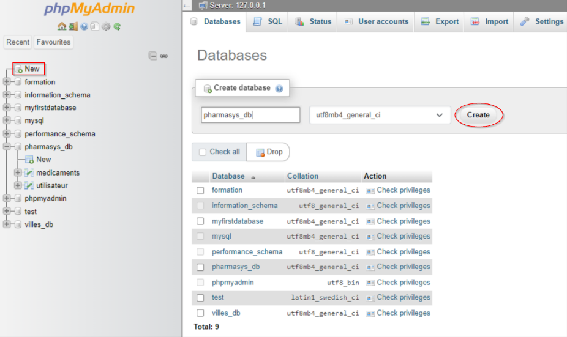
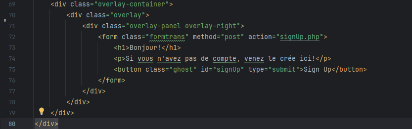

# The Context

## PharmaSys, Pharmaceutical Stock Manager

- PharmaSys is an innovative and intuitive pharmaceutical stock management application
  developed with care by Keenan and Dylan.
  This solution is specifically designed to optimize the management of pharmaceutical warehouse,
  ensuring smooth and efficient stock management.

- PharmaSys positions itself as an indispensable ally for pharmaceutical warehouse,
  offering optimized stock management that ensures not only the availability of products
  but also their safety and compliance. Developed by Keenan and Dylan,
  PharmaSys combines innovation and practicality to transform pharmaceutical stock management
  into a simple and effective task.

- Currently based in Luxembourg, PharmaSys is a leading provider for pharmaceutical
  warehouse in France. They supply every pharmacy within a 200 km radius,
  ensuring all stock is managed efficiently and effectively.

- For more detail about the application, it can manage the stock of the warehouse and also
  take orders from pharmacy's that need supply.

# Setting up

## required element

### XAMPP

XAMPP makes it easy to set up a development environment and a MySQL or MariaDB database.

First you will need to download XAMPP here : https://www.apachefriends.org/download.html

**Then, download this version :**\

After the download finish you can lunch the installation and follow evey step without
change any setting

## Our Project

Now you will need to access our code to be able to do the management.

So you will need to go on GitHub and download it

Here the link to the deposit : https://github.com/BigFootLime/B1

And download it here :\

Now you will need to extract the ZIP (with Winrar or 7zip (or anything else)) in the good
location :\
**C:\xampp\htdocs**

## Setting Up of the DataBase

**First of all you will need to start XAMPP service\
Like this :**\

**Then you will need to go on phpMyAdmin
There is the link :** http://localhost/phpmyadmin/index.php

**Now you will need to creat a DB (DataBase) like this :**\

**We export our DataBase in our B1 folder and you can find it right here :**\

**So for import the DataBase you can go on phpMyAdmin and put you in the DataBase
you juste created./
Now you go in 'Import' and do the following step**

If you have the tables 'medicaments' and 'utilisateur' everything is good,
if you have not, retry, you probably did something wrong or put it in the wrong DB.

## DataBase

**there is how did the table 'medicaments' and 'utilisateur'look like with more details**\
 

**And you will say, 'what they are used for?', haha let me introduce you the table !**

### Utilisateur

this table is use for the inscription of the user, when they go to the SingUP page,\
they will enter there information (mail, name, surname and the password). In our php code
we also do some modification to keep everything 'safe' and reliable. \
It mean that we hash
the entered password for more safety and also make the 'mail' column UNIQUE so it make sure
only 1 mail is used

### Medicaments

<!-- a Keenan d'expliquer ce que lui a fait-->

## Explanation php SignIn and SignUp

Let me introduce some code that I did.\
When we go on 'localhost/b1/src' in our browser, we directly access to the 'login.php' page\
it's because our index automatically redirect us on this page.\
I will not talk much now for the 'login.php' code cause first, we need to SignUp !

So for the SignUp button I just do a 'form' with a 'action' that take us directly to the
'signUp.php' page.\
**Take a look :**\

### SignUp

Let's take a look to the 'signUp' code,

Here, when do you want to sign up you have to enter :\
Name\
Surname\
E-mail  
Password\
We did some specific setting to make sure that everything is safe and reliable.\
So I will skip the first setting because it is just how to link and connect to the DataBase.\
I will talk with more detail for the setting, so you can understand what they did.

First I put every PHP code in a 'try catch' bloc, then in there I put some 'if' to do my code\
The first one is a condition that make sure every case is filled and if not it put an error message\

after I put 3 other 'if' condition in the first one to check 3 thing :  
If the Name and the Surname is more than 2 character long, if not, it sends an error message  
If the mail is taken, if the mail is took it send an error message  
If the password is 10 character long, if not it send an error message  

If every condition is reunited, we can put everything in our DataBase  

I also do some little php code for put error message between each 'input'  

### SignIn

here how the SignIn code work :

first we initialize an error variable '$error' to store any error messages.  
The code checks if the HTTP request method is POST and if the POST data is not empty.  
We initialize 2 variable, email and password  
After the code prepare and executes a SQL statement to select  
a user record based on the provided email.
For the password checks, it if the fetched user record exists and if  
the provided password matches the stored password hash using password_verify.
If the credentials are correct, it stores the user's ID in the session
and redirects to our main page
and we have the 'else' here to put a message if there is one part missing  
 

Just after in the html part I put a 'form' that put an error message if the credential  
are wrong and the input after ensures that the email field will  
retain the value entered by the user  

<!-- a Keenan d'expliquer ce que lui a fait-->

## Explanation php Dashboard and Product Management

When we login correctly, with the correct information, we can direclty access the 'acccueil.php' page\

Once on the dashboard, a few charts appear explaining the current stock amount for each product, the products currently out of stock and the most sold items. Just hover over the charts and information will display.
**Take a look :**\

To do this, i used a plugin called Chart.js. To display the info from the database I had to retrieve the info using PHP and then use json_encode to convert the info into a string and therefore displaying it in Javascript.

### Dashboard

Let's take a look to the 'dashboard' code,

### Creation of the Deployment server

first of all we will need to do the installation of OCI, we need to register and then create  
a instance on it. the only setting to change is change the OS to the lastest ubuntu .iso  
and also save the private register key (you can also save the public one) then you will be able  
to create and start the instance.

when this is done, you will need to download PuTTY. lunch PuTTYgen and translate the private key  
you download. Now you can lunch PuTTY, put the public IP adress of OCI and then in SSH / Auth / Credential  
you will put the private key that we translate before.

now you are able to connect on it. when you open your Ubuntu server, the username is 'ubuntu'  
then you nee to do a `sudo apt update && upgrade` you can also, if you want, install neofetch `apt get install neofetch `

Now you need to install Apache, MySQL, PHP and Git :
apache : `sudo apt install apache2 `  
MySQL : `sudo apt install mysql-server`  
PHP : `sudo apt install php-fpm`  
Git : `sudo apt install git` // `git clone https://github.com/BigFootLime/B1.git`  
and you can check the status with `git status`
